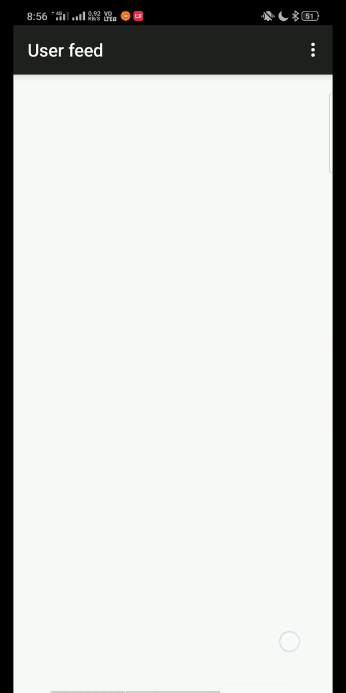
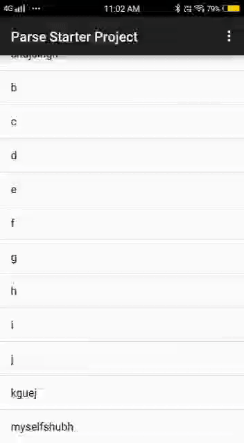
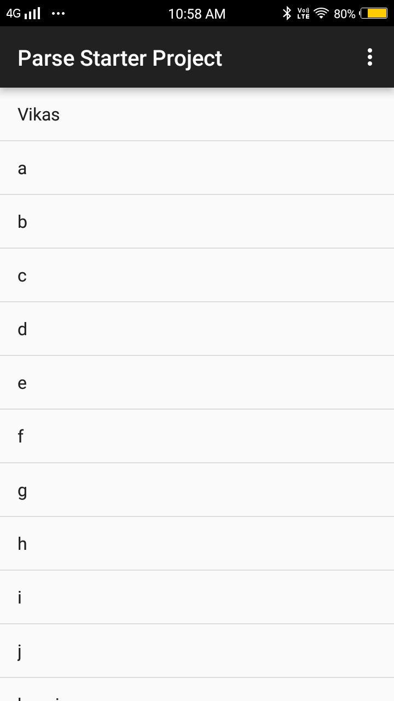

# Gec-Talks

Gec-Talks is a mini-project that can use for a chat with the help of snaps. It depicts some feature of Twitter. Like Twitter is used to share your views, thoughts by twitting it but here one can do the same by sending snape on their profile log so that anyone who made his/her account on Gec-Talks can see your snaps by clicking on your profile.

## Snapes and Videos

  

## Building and Running Gec-Talks like Application
You will need a parse server for running this application and add this project uses its function and its database to store data, You can get information about `Parse` from [this link](https://parseplatform.org/). 
 1. Clone the source code

 `git clone https://github.com/VikasPandey121/Gec-Talks.git`

2. Use parse bitnami from `AWS server` and create an `EC-2 instance`. for more information go to [this link](https://aws.amazon.com/)

